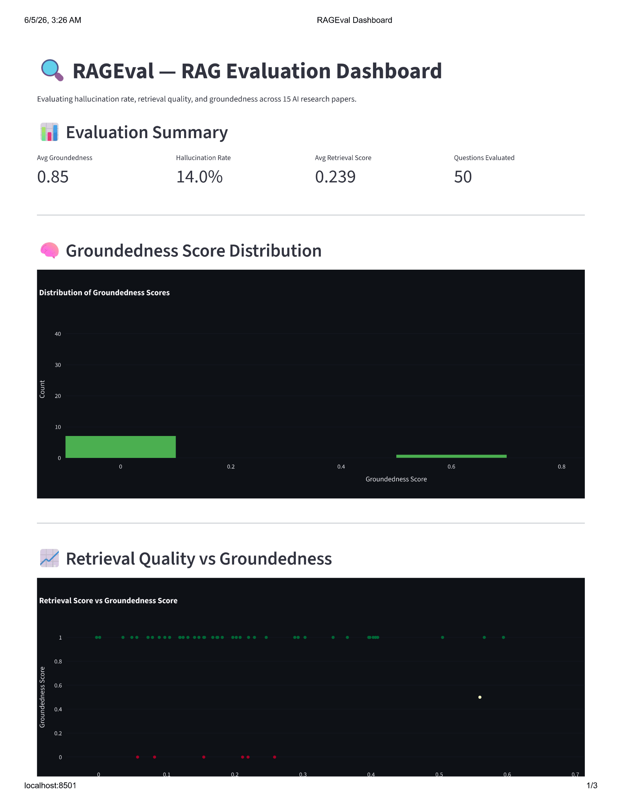
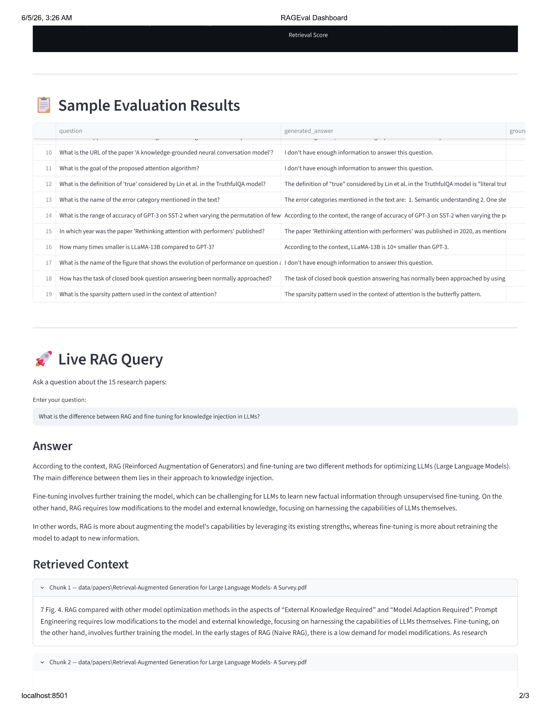
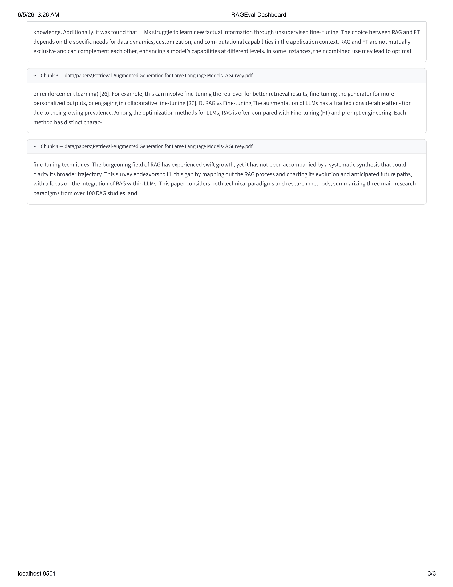

# RAGEval 🔍
### RAG Pipeline with Hallucination Detection & Evaluation Framework

> A production-grade RAG system built over 15 AI research papers with a custom evaluation framework measuring hallucination rate, retrieval precision, and groundedness score.

---

## The Problem
RAG systems are only as good as their retrieval and generation quality.
Most teams build RAG pipelines but never evaluate them properly —
leading to hallucinations, poor retrieval, and unreliable outputs in production.
RAGEval solves this by providing a full evaluation framework on top of the RAG pipeline.

---

## Dashboard

---

## Architecture

~~~
┌─────────────────────────────────────────┐
│            RAGEval Pipeline             │
│                                         │
│  15 AI Research Papers (PDFs)           │
│              │                          │
│  PDF Ingestion + Chunking               │
│  (PyPDF + RecursiveCharacterSplitter)   │
│              │                          │
│  FAISS Vectorstore                      │
│  (HuggingFace all-MiniLM-L6-v2)         │
│              │                          │
│  RAG Chain (LangChain + Groq)           │
│              │                          │
│    ┌─────────┴──────────┐               │
│  Retrieval            Generation        │
│  Evaluation           Evaluation        │
│    │                    │               │
│  Cosine Similarity    LLM-as-Judge      │
│  Scoring              (Chain of Thought)│
│              │                          │
│  Streamlit Evaluation Dashboard         │
└─────────────────────────────────────────┘
~~~

---

## Benchmark Results (50-question evaluation)

| Metric | Value |
|--------|-------|
| Avg Groundedness Score | 0.85 |
| Hallucination Rate | 14.0% |
| Avg Retrieval Score | 0.239 |
| Best Chunk Score | 0.312 |
| Question Relevance | 0.522 |
| Questions Evaluated | 50 |

---

## Dataset
- **15 AI research papers** including Attention Is All You Need, BERT, GPT-3, LLaMA, LoRA, RAG, Self-RAG, RAGAS, Chain of Thought, FlashAttention and more
- **418 pages** of content
- **3,136 chunks** for retrieval
- **199 auto-generated QA pairs** used as ground truth for evaluation

---

## Evaluation Framework

### Hallucination Detection (LLM-as-Judge)
Uses chain-of-thought prompting to score whether generated answers are grounded in retrieved context:
- Lists key claims in the answer
- Checks each claim against retrieved context
- Returns groundedness score (0.0 - 1.0)

### Retrieval Quality Evaluation
Measures retrieval precision using cosine similarity:
- Similarity between retrieved chunks and ground truth answer
- Similarity between retrieved chunks and original question
- Best chunk score across top-k results

### Key Finding
Identified LLM-as-judge scoring instability across model sizes — smaller models were too strict (40% hallucination rate), larger models too lenient (0% hallucination rate). Solved using chain-of-thought prompting which produced calibrated scores (14% hallucination rate).

---

## Tech Stack

| Component | Technology |
|-----------|------------|
| Document Loading | LangChain + PyPDF |
| Text Splitting | RecursiveCharacterTextSplitter |
| Embeddings | HuggingFace all-MiniLM-L6-v2 |
| Vector Store | FAISS (Facebook AI) |
| LLM Backend | Groq API (llama-3.1-8b-instant) |
| Evaluation Judge | Groq API (llama-3.3-70b-versatile) |
| Dashboard | Streamlit + Plotly |

---

## Local Setup

~~~bash
git clone https://github.com/Arin1610/rageval.git
cd rageval
python -m venv venv
venv\Scripts\activate
pip install -r requirements.txt
~~~

Add `.env` file:
~~~
GROQ_API_KEY=your_key_here
~~~

Build vectorstore:
~~~bash
python -m app.retriever
~~~

Run evaluation:
~~~bash
python -m eval.run_eval
~~~

Launch dashboard:
~~~bash
streamlit run dashboard/app.py
~~~

---

## Project Structure

~~~
rageval/
├── app/
│   ├── ingest.py         ← PDF loading + chunking
│   ├── retriever.py      ← FAISS vectorstore
│   ├── rag_chain.py      ← LangChain RAG pipeline
│   └── llm_client.py    ← Groq integration
├── eval/
│   ├── generate_qa.py    ← Auto-generate QA pairs
│   ├── hallucination.py  ← Hallucination scorer
│   ├── retrieval_eval.py ← Retrieval quality scorer
│   └── run_eval.py       ← Full evaluation runner
├── dashboard/
│   └── app.py            ← Streamlit dashboard
├── data/
│   └── papers/           ← 15 PDF research papers
├── results/
│   └── eval_results.csv  ← Evaluation output
└── requirements.txt
~~~

---

